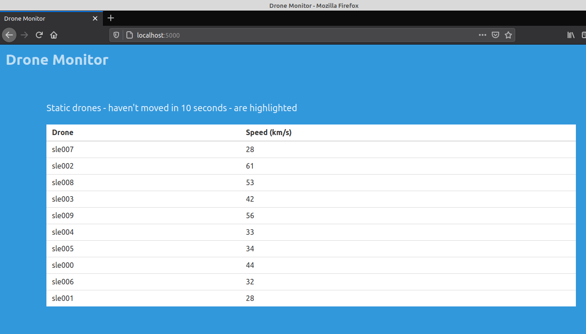

# Drone Monitor

This app simulates the location tracking of drones in realtime as they fly around the country.

The application is built with the Flask python framework with the Python
Socket IO powering its `realtimeness`.

## How it works

The application has two main endpoints.

- The `index` route which loads the frontend dashboard showcasing the list of
  drones along with their current speeds
- The `update` route which accepts post requests from the drones and notifies
  the dashboard application - via socket.io - of the update

The application holds a variable in memory which stores the last update time
and coordinates of each drone. It then calculates the distance travelled when
the drone updates its coordinates. It uses the difference between the time of
the update and the last update time together with the deduced `2D` distance to
estimate the drone's average speed.

It also uses that difference together with whether the drone has technically
not moved a distance less than a metre since the last update to determine if
the drone should be highlighted on the dashboard.

It is only highlighted when the former is more than 10 seconds and the latter
is true.

## Assumptions made in the design of the application

- Network latency is regarded as negligible. It is assumed a very efficient
  connection exists between the drone and the server.
- 2D space. Drones fly in 3D, however, for the purposes of the assignment, a
  2D orientation is assumed. This assumption affects the calculation of
  distance travelled and the average speed.
- Data always reaches the server. Every post request the drones make is
  processed successfully on the server. Lost packets or connectivity downtimes
  are considered negligible to matter.
- Drones are confined to flying in an approximated bounding box for
  Sierra Leone. The bounding box defines the (min|max)latitude and (min|max)
  longitude that captures the entire shape of the Sierra Leone geographic area.
  As the shape of Sierra Leone is not exactly symmetric, unlike its bounding
  box, a drone could technically fly over territorial Guinea or Liberia as per
  the simulation data. This technical discrepancy is considered
  'not-that-relevant' for this assignment.

## Build Image

```bash
  docker build --rm -tag drone-monitor .
```

## Run Image

```bash
  docker run -it --publish 5000:5000 drone-monitor --name <get creative>
```

## Access Dashboard

Open [localhost](http://localhost:5000) in any browser


